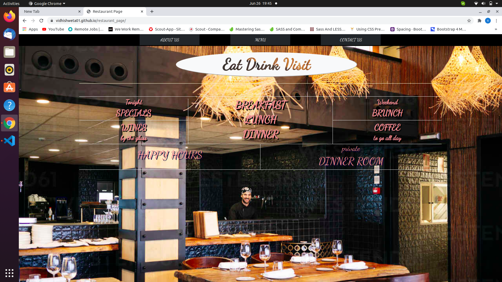
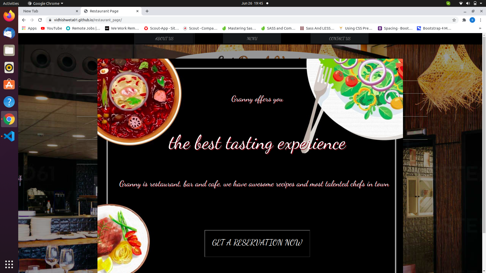
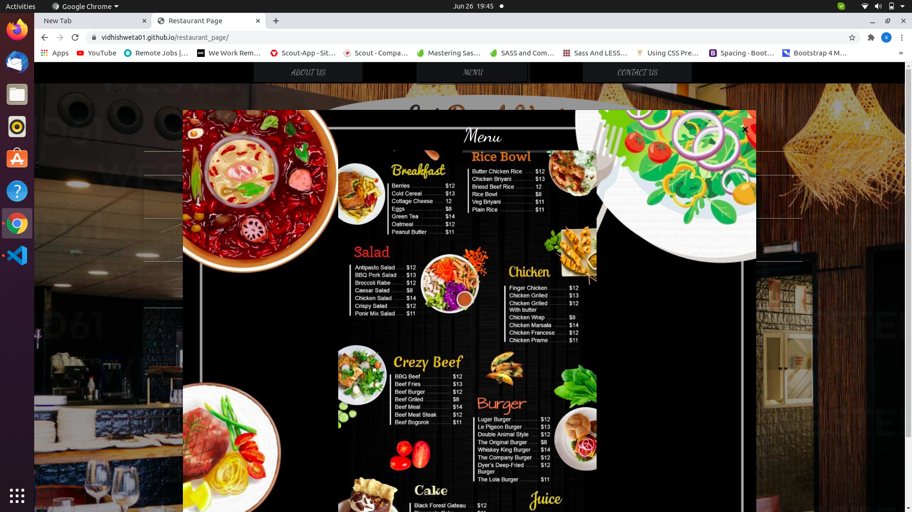
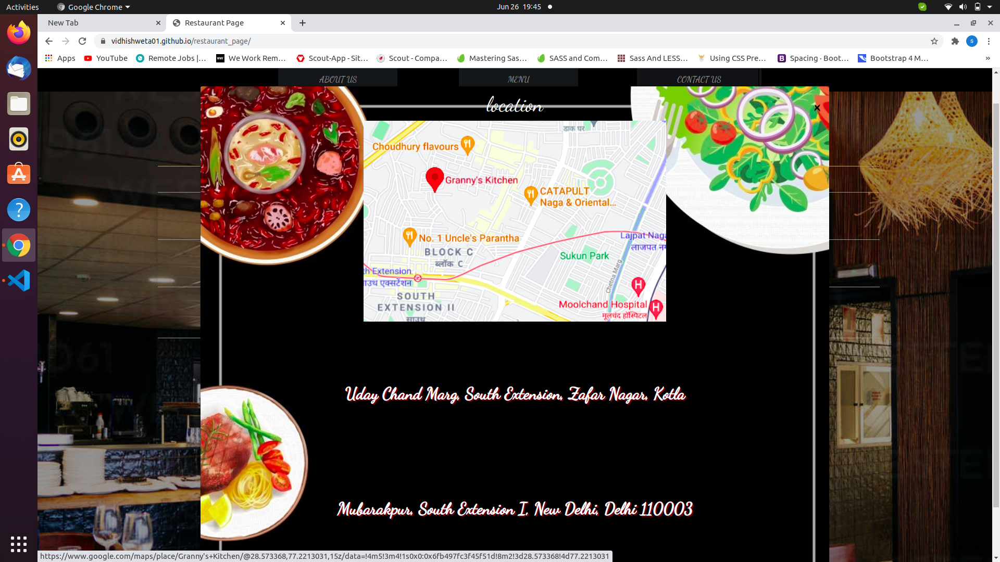

# retaurant_page

A Restaurant Page

It is restaurant opening page has three pages about us, menu, contact us

## Built With

javascript

## Live Demo

[Try a lıve demo](https://vidhishweta01.github.io/restaurant_page/)

## Getting Started

Download or clone this repo by using git clone https://github.com/vidhishweta01/restaurant_page.git
Enter the project folder and run locally by using a VS Code extension such as Live Server.

## Authors 👤

### Shweta Srivastava

_[Github](https://github.com/vidhishweta01)

_[LinkedIn](http://linkedin.com/in/shweta-s-15a57070)

## Show your support ⭐️⭐️

Give a star if you like this project!

## License 📝

This project is [MIT](https://www.mit.edu/~amini/LICENSE.md) licensed.
